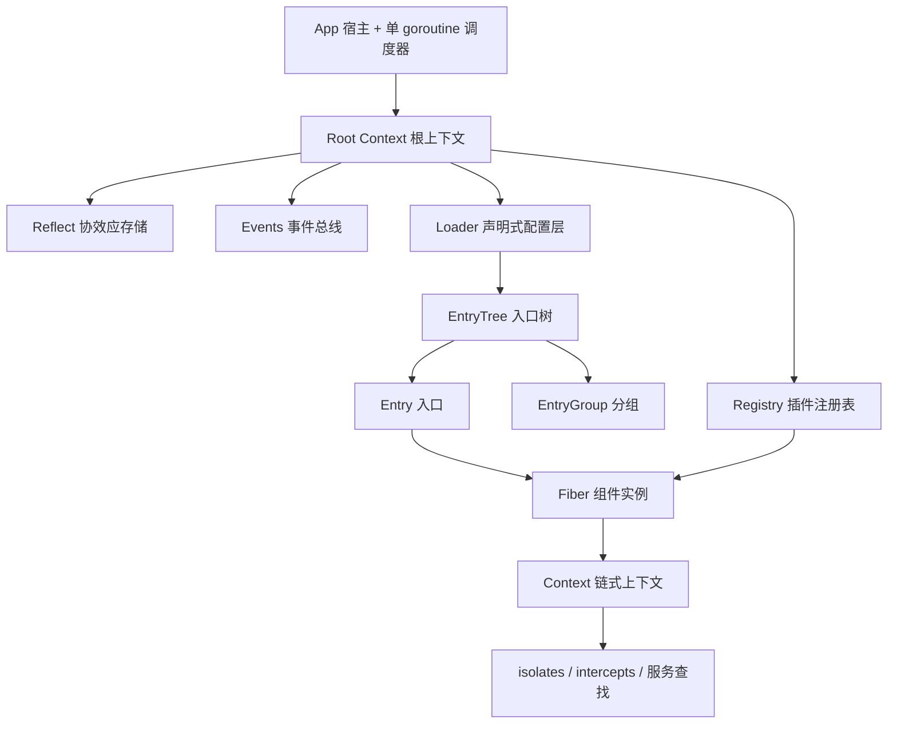
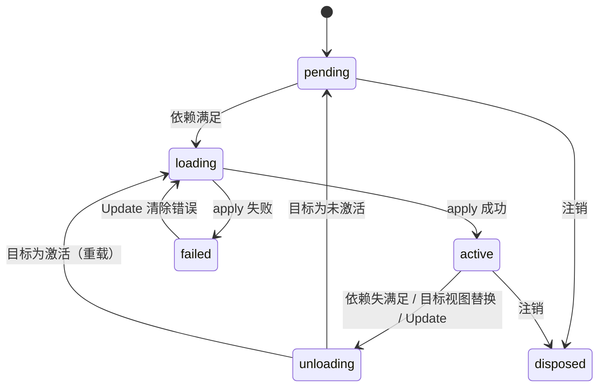

# Cordis (Go)

[](https://github.com/metaRobin/cordis/actions/workflows/ci.yml)

> 论文《Spatiotemporal Composability》所提出的**时空可组合组件模型**的纯 Go 实现。
> 零第三方依赖 · 单 goroutine 免锁运行时 · 35 项测试全绿（含 `-race`）· Apache-2.0

---

## 1. 项目简介

`cordis` 是一套**组件运行时**：它让「组件」在两个维度上同时可组合。

| 维度 | 主张 | 本实现的机制 |
| --- | --- | --- |
| **时间维**（temporal） | 每个副作用都携带**显式的逆操作**，由运行时追踪；组件卸载时环境被完全还原 | `ctx.Effect` / `ctx.Provide` / `ctx.On` 一律返回 `Dispose`，Fiber 卸载时按 **LIFO 逆序**自动回收 |
| **空间维**（spatial） | 组件以**协效应（coeffect）**声明对服务的依赖；依赖满足状态变化时，运行时自动驱动组件的加载与卸载 | `Plugin.Inject` 声明依赖 → `epoch` 推导目标视图 → 状态机自动奔跑 |

一句话：**你只声明「我要什么」和「我怎么创建」，运行时负责在正确的时机创建、在依赖消失时彻底拆掉。**

---

## 2. 核心概念

| 概念 | 论文 / 官方 TS 实现 | 本实现 | 说明 |
| --- | --- | --- | --- |
| 组件定义 | plugin | `Plugin` | `Name` + `Inject`（协效应）+ `Validate`（配置校验）+ `Apply`（组件逻辑） |
| 组件实例 | fiber / scope | `Fiber` | 持有效果追踪表、依赖快照、对外服务表与生命周期状态机 |
| 目标视图 | `epoch` | `epoch`（未导出） | 由当前依赖实现集合推导；任何替换都产生新 epoch |
| 协效应存储 | `ReflectService` | `Reflect` | `isolateKey{name, realm}` → 服务实现的全局映射 |
| 隔离域 | isolation / realm | `Context.Isolate` | 同名服务在不同域中互不可见，支持多套服务栈并存（多租户） |
| 拦截配置 | intercept | `Context.Intercept` | 由服务提供者读取的构造期配置，沿上下文链合并 |
| 插件注册表 | registry | `Registry` | 以 `*Plugin` 为身份的 `Plugin → Runtime` 映射 |
| 事件总线 | events | `Events` | 监听器随注册它的 Fiber 生命周期自动回收 |
| 声明式配置 | loader | `Loader` | `Entry` / `EntryGroup` / `EntryTree` + 协调算法 |

---

## 3. 架构总览



分三层：

1. **宿主层** —— `App` 持有根上下文与调度器 goroutine；`App.Do` / `App.DoSync` 是外部 goroutine 的唯一合法入口。
2. **运行时层** —— `Fiber` / `Context` / `Reflect` / `Registry` / `Events` 构成效果追踪与依赖解析的全部机制。
3. **声明式配置层** —— `Loader` / `EntryTree` / `EntryGroup` / `Entry` 把「实例化组件」从过程式代码变为可协调的配置树。

### 文件职责

| 文件 | 行数 | 职责 |
| --- | --- | --- |
| `cordis.go` | 93 | 包文档、`FiberState`、错误值集合、`Plugin` 定义 |
| `app.go` | 225 | `App` 宿主、单 goroutine `scheduler`、`Wait` / `Close` |
| `context.go` | 203 | 统一上下文、`Isolate` / `Intercept` 派生、`Get` / `Provide` 门面 |
| `fiber.go` | 560 | Fiber 状态机、`epoch` 惯性追逐、效果与 LIFO 撤销、配置热更新 |
| `reflect.go` | 241 | 协效应存储、域键解析、依赖倒排索引与变更通知（dependant-first） |
| `registry.go` | 191 | `Plugin → Runtime` 映射、`Plugin` / `PluginInject` / `Inject` 实例化入口 |
| `events.go` | 189 | 事件总线（`Emit` / `Serial` / `Bail` / `Parallel`）与 `Logger` |
| `disposable.go` | 72 | 两阶段撤销步骤 `disposeStep` 与保序 `disposableList` |
| `loader.go` | 788 | 声明式配置层：`EntryOptions` / `Entry` / `EntryGroup` / `EntryTree` / `Loader` |
| `example/main.go` | 174 | 端到端示例：数据库 + 缓存 + Web，覆盖热重载 / 降级 / 隔离域 |
| `cordis_test.go` | 912 | 核心运行时测试（19 项 + 2 基准） |
| `loader_test.go` | 707 | 声明式配置层测试（15 项 + 1 基准） |
| `index_internal_test.go` | 60 | 依赖倒排索引的生命周期不变量（白盒） |

---

## 4. 快速开始

```bash
git clone git@github-metaRobin:metaRobin/cordis.git
cd cordis

go test ./...          # 35 项测试
go test -race ./...    # 竞态检测
go vet ./...
go run ./example       # 端到端示例，打印各入口状态
```

### 作为依赖使用

`go.mod` 中模块路径为裸名 `cordis`（非域名路径），本地引用需显式 `replace`：

```
// 你的项目 go.mod
require cordis v0.0.0

replace cordis => ../cordis
```

```go
import cordis "cordis"
```

> 若需直接 `go get`，把 `go.mod` 的 `module` 改为完整路径（如 `github.com/metaRobin/cordis`）并同步修正 `example/main.go` 的 import。

---

## 5. 使用指南

### 5.1 定义与实例化组件

```go
app := cordis.New()
defer app.Close()

db := &cordis.Plugin{
    Name: "database",
    Apply: func(ctx *cordis.Context, config any) error {
        dsn := config.(string)
        if _, err := ctx.Provide("database", dsn, nil); err != nil {
            return err
        }
        _, err := ctx.Effect("conn", func() (cordis.Dispose, error) {
            return func() { log.Println("close", dsn) }, nil
        })
        return err
    },
}

app.Do(func(ctx *cordis.Context) {
    ctx.Plugin(db, "postgres://prod")
})
```

### 5.2 副作用与撤销

所有副作用都必须能给出逆操作，且 `Dispose` **幂等**：

| API | 用途 |
| --- | --- |
| `ctx.Effect(label, fn)` | 通用效果：`fn` 返回 `Dispose` |
| `ctx.EffectIter(label, iter)` | 增量效果：`yield` 多次登记，全部 LIFO 撤销 |
| `ctx.Provide(name, value, check)` | 注册服务，撤销遵循 **dependant-first**（先等依赖者下线，再销毁自身） |
| `ctx.On` / `ctx.Once` | 注册事件监听器，随 Fiber 卸载自动注销 |

### 5.3 服务与反应式依赖

```go
cache := &cordis.Plugin{
    Name:   "cache",
    Inject: map[string]any{"database": nil}, // 协效应：必需依赖
    Apply: func(ctx *cordis.Context, _ any) error {
        dsn, ok := ctx.Get("database")
        if !ok {
            return errors.New("database unavailable")
        }
        _, err := ctx.Provide("cache", "cache:"+dsn.(string), nil)
        return err
    },
}
```

`database` 提供者下线时，`cache` 的效果被自动回收并回到 `pending`；提供者回归时自动恢复。**无需手写任何监听或重试逻辑。**

`Provide` 的第三个参数 `check func() bool` 用于表达「服务存在但暂不可用」：每次依赖解析都会调用它，返回 `false` 时依赖者立即视为未满足。`check` 内 panic 会被吞掉并按未满足处理（记日志）。

### 5.4 隔离域（多租户）

```go
ctx.Isolate("database", "tenant-a")   // 同域共享，跨域不可见
ctx.Intercept("database", myConfig)   // 供提供者读取的拦截配置
```

在 loader 层用 `EntryOptions.Isolate` 声明：`true` 表示入口私有域（键 `#入口ID`），字符串表示共享域（键 `@标签`）。

### 5.5 事件

| 方法 | 语义 |
| --- | --- |
| `Emit` | 同步分发，忽略返回值与错误（错误记日志） |
| `Serial` | 串行，首个返回非 nil 的监听器终止分发 |
| `Bail` | 同 `Serial`，但同步抛出 panic |
| `Parallel` | 聚合全部错误（单线程下等价于串行） |
| `EmitFiltered` | 带显式域过滤规则分发 |

内置事件：`internal/plugin`（实例创建/注销）、`internal/status`（状态迁移）、`internal/service`（服务上下线）。

### 5.6 声明式配置层

```go
loader := cordis.NewLoader(app, func(name string) (*cordis.Plugin, error) {
    return plugins[name], nil
})

loader.Load([]cordis.EntryOptions{
    {ID: "db",    Name: "database", Config: "postgres://prod"},
    {ID: "cache", Name: "cache"},
    {ID: "web",   Name: "web",      Config: 8080},
})
```

| 操作 | 行为 |
| --- | --- |
| `Load(options)` | 整体协调：新增创建、缺失移除、存留更新，顺序以配置为准 |
| `Create` / `Remove` / `Update` | 单入口增删改；`Update` 支持跨组移动（触发上下文重建 + 完整重载） |
| `EntryGroup` | 分组入口，`Group: true`；禁用级联会禁用全部后代 |
| `EntryOptions.ID` | **全树唯一**（索引以短 ID 为键，寻址用 `group:child` 路径）；重复 ID 被拒绝（跳过并记日志） |
| `EntryOptions.Inject` | 入口级依赖增删覆盖（`cordis.DepRemove` 显式移除声明的依赖） |
| `EntryTree.OnCommit` | 每次结构变更后同步回调，供持久化落盘 |
| `NewLoader` | 同名插件可多次实例化，共享 `Runtime` |

配置变更的分派规则（`Entry.update`）：

- 禁用（含级联）→ 注销 Fiber 并摘下分组子树；
- 空间声明变化（`Name` / `Group` / `Inject` / `Isolate` / `Intercept`）→ **同步摘下旧子树**、注销旧实例，再以新声明完整重载（旧实例的效果回收是异步的，子树结构必须立即一致，否则重建时短 ID 索引冲突）；
- 仅 `Config` 变化 → 走 `Fiber.Update` 热重载；配置未过 `Validate` 时 Fiber 进入 `failed` 并保留在入口上，修正后原地恢复；
- 分组入口 → 通过更新钩子协调子入口，而非重启自身；分组配置类型错误（非 `[]EntryOptions`）记日志并保留现有子入口。

---

## 6. 并发模型

复刻 JavaScript 单线程事件循环：`App` 内置**唯一一个**调度 goroutine，全部状态转换任务在其中**串行**执行。

- **用户回调（`Apply` / `Dispose` / 事件监听器）天然运行于调度器内**，可直接调用 `Context` 上的任何 API，**无需加锁**。
- 外部 goroutine 一律通过 `App.Do`（异步）或 `App.DoSync`（同步阻塞）进入。
- ⚠️ **不得在调度器上下文内调用 `DoSync` / `Wait`** —— 会死锁。
- 任务队列为**无界 slice + 互斥锁**（不是固定容量 channel）：单个任务内部继续投递任务不会自阻塞，语义与 JS 事件循环一致。

`App.Wait()` 阻塞至队列排空且全部 Fiber 稳定，**返回是否真正收敛**（调度器已停止或达到轮询上限后放弃时返回 `false` 并告警）；`App.Close()` 冻结根 fiber 目标视图，沿效果链级联回收全部子组件并停止调度器（可安全重复调用）。

---

## 7. 生命周期状态机

| 状态 | 含义 |
| --- | --- |
| `pending` | 已注册但依赖未满足，等待激活 |
| `loading` | 依赖已满足，正在执行组件逻辑 |
| `active` | 组件逻辑执行成功且全部依赖仍然满足 |
| `failed` | 曾在 `active` 之后执行失败；效果已回收，等待下次 `Update` 恢复 |
| `unloading` | 正在按 LIFO 逆序回收效果 |
| `disposed` | 已从父上下文注销，生命周期终结 |



**epoch 惯性链**：epoch 变化并不立即执行转换，而是把 `pump` 任务投递到调度器。`pump` 按**最新** epoch 决策，转换完成后若 epoch 又变（同步代码在转换期间再次改变目标视图）则继续追逐，直到现状与目标一致——等价于官方实现的 reload/unload 相互链式触发。

---

## 8. API 速览

### `App`

| 方法 | 说明 |
| --- | --- |
| `New()` | 创建应用并启动调度器 |
| `Do(f)` / `DoSync(f)` | 在调度器上异步 / 同步执行；`DoSync` 返回任务是否确实执行完毕 |
| `Root()` | 根上下文（仅限调度器上下文使用） |
| `Wait()` | 等待系统稳定，返回是否收敛 |
| `Close()` | 级联回收全部组件并停止调度器 |
| `Logger()` | 取日志器（`Error` / `Warn` / `Info` 均可替换） |

### `Context`

| 方法 | 说明 |
| --- | --- |
| `Get(name)` / `GetMust(name)` | 解析服务（沿 Fiber 链向上，域感知；提供者未 `active` 时视为不可见） |
| `Provide(name, value, check)` | 注册服务，返回与 Fiber 绑定的 `Dispose` |
| `Set(name, value)` | 更新本 Fiber 已注册的服务值 |
| `Effect` / `EffectIter` / `On` / `Once` / `Emit` | 效果与事件 |
| `Isolate(name, realm)` / `Intercept(name, cfg)` / `InterceptOf(name)` | 空间维声明 |
| `Plugin(p, config)` / `Inject(deps, apply)` | 实例化组件 / 声明动态依赖 |
| `App()` / `Fiber()` / `Root()` / `Entry()` | 上下文导航 |

### `Registry` 的错误契约

| 返回 | 含义 |
| --- | --- |
| `(nil, err)` | 结构性失败（插件无效或父上下文已失活），Fiber 从未注册 |
| `(f, err)` | 配置未通过 `Validate`——Fiber 已注册且处于 `failed`，可经 `f.Update` 修复或 `f.Dispose` 注销 |
| `(f, nil)` | 成功 |

### `Fiber`

`State()` · `Err()` · `Config()` · `UID()` · `Update(config)` · `OnUpdate(hook)` · `Dispose()` · `Effect(label, fn)` · `EffectIter(label, iter)`

### 错误值

`ErrInactiveEffect` · `ErrServiceDuplicate` · `ErrServiceNotFound` · `ErrInvalidPlugin` · `ErrEntryNotFound`

---

## 9. 示例输出

`go run ./example` 覆盖四个场景：

| 场景 | 观察点 |
| --- | --- |
| 初始加载 | 依赖序驱动：`database` → `cache` → `web` |
| 热重载 `web: 8080 → 9090` | 旧实例先 `shutdown`，新实例再 `listen` |
| `db` 禁用 / 恢复 | `cache`、`web` 自动回到 `pending`，恢复后自动 `active` |
| 隔离域多租户双栈 | `tenant-a` / `tenant-b` 同名服务并存互不干扰 |
| 动态移除 `db-b` | 该栈整体降级，`tenant-a` 不受影响 |

---

## 10. 测试覆盖

`go test ./...` → **35 项全部通过**；`go test -race ./...` 无竞态报告；另有 2 个基准（`-bench .`）。

CI（`.github/workflows/ci.yml`）在 **Go 1.22.x**（`go.mod` 声明的最低版本）与 **stable** 两档上执行：`gofmt -l` 零差异、`go vet`、`go build`、`go test -race`、基准运行、`go run ./example` 冒烟。

**核心运行时（`cordis_test.go`，19 项）**

| 测试 | 覆盖点 |
| --- | --- |
| `TestPluginLifecycle` | 生命周期状态迁移 |
| `TestReactiveCoeffects` | 反应式依赖：提供者上下线驱动依赖者 |
| `TestDependantFirstDispose` | 撤销顺序保证 |
| `TestIsolation` / `TestSharedRealm` | 私有域 / 共享域语义 |
| `TestHotReload` | 配置热重载 |
| `TestFailureAndRecovery` | `apply` 失败与 `Update` 恢复 |
| `TestConfigValidation` / `TestPluginErrorContract` | `Validate` 失败路径与错误契约 |
| `TestServiceEvents` | `internal/service` 事件 |
| `TestDuplicateProvide` | 同域重复注册 |
| `TestEpochChase` | 转换期间 epoch 再次变化的追逐 |
| `TestEventListenerCleanup` | 监听器随 Fiber 回收 |
| `TestRootCloseCascades` | 根关闭级联 |
| `TestCheckFunction` | `check` 不健康判定 |
| `TestServiceHiddenWhileProviderUnloading` | 撤销窗口内服务可见性 |
| `TestDisposePanicLogged` | 撤销 panic 被记录且不阻断后续 |
| `TestWaitReportsConvergence` | `Wait` / `DoSync` 的收敛与执行结果上报 |
| `TestSchedulerUnboundedQueue` | 单任务内超量投递不自死锁 |

**声明式配置层（`loader_test.go`，15 项）**

| 测试 | 覆盖点 |
| --- | --- |
| `TestLoaderBasicLoad` / `TestLoaderReconcile` / `TestLoaderConfigReload` | 加载、整体协调、配置热重载 |
| `TestLoaderGroup` / `TestLoaderGroupIsolateRebuild` / `TestLoaderGroupConfigTypeError` | 分组协调、空间声明变化重建、配置类型错误保留子树 |
| `TestLoaderEntryIsolate` / `TestLoaderEntryInject` | 入口级域与依赖声明 |
| `TestLoaderTreeOperations` / `TestLoaderGroupMoveRebuild` | 入口树增删改与跨组移动（含分组子树同步摘下重建） |
| `TestLoaderDuplicateShortID` | 重复短 ID 拒绝（含跨组） |
| `TestLoaderConfigErrorRecovery` | 校验失败后原地恢复 |
| `TestLoaderCommitHook` / `TestLoaderSelfDispose` | 提交钩子、插件自行卸载 |
| `TestLoaderLargeLoad` | 1100 入口单次 Load 不死锁 |

**内部不变量（`index_internal_test.go`，1 项，白盒）**

`TestReflectIndexLifecycle` —— 依赖倒排索引的 track/untrack 严格配对（注销、未注册失败路径与 `Close` 级联后索引回空）

**基准**

`BenchmarkServiceNotify`（服务上下线通知代价，倒排索引前后对比见提交历史）· `BenchmarkLoaderLoad`（声明式协调吞吐）

---

## 11. 参考

- 论文《Spatiotemporal Composability》—— 时空可组合组件模型的理论来源
- 官方 TypeScript 实现 —— 本仓库逐模块对照的语义基准（概念映射见 §2）
- 包级设计说明见 `cordis.go` 顶部注释；各模块内部设计取舍见对应源文件注释

---

## 12. 许可

本项目采用 [Apache License 2.0](LICENSE) 授权，全文见仓库根目录 `LICENSE`。

```
Copyright 2026 metaRobin

Licensed under the Apache License, Version 2.0 (the "License");
you may not use this file except in compliance with the License.
You may obtain a copy of the License at

    http://www.apache.org/licenses/LICENSE-2.0

Unless required by applicable law or agreed to in writing, software
distributed under the License is distributed on an "AS IS" BASIS,
WITHOUT WARRANTIES OR CONDITIONS OF ANY KIND, either express or implied.
See the License for the specific language governing permissions and
limitations under the License.
```

> 注意：本仓库对照的**官方 TypeScript 实现**为独立项目，其授权与本仓库无关；论文版权归原作者所有。
